A project by Magnus L. Holtet, Kristoffer Nyvoll, Liv Elise Herstad and Snorre Kristiansen.

## Project structure

This repository contains the entire BACkup project. The tech stack is the following:

### Root

- [Node](https://nodejs.org/en/) to bootstrap the project.
  - [Concurrently](https://www.npmjs.com/package/concurrently) to start the backend and frontend with the same command.
  - [wait-on](https://www.npmjs.com/package/wait-on) to delay the frontend start.

### Frontend:

- [React.js](https://reactjs.org)
  - [Reach Router](https://reach.tech/router)
  - [Styled Components](https://www.styled-components.com)
- [ESLint](https://eslint.org/) for code quality.
- [Jest](https://jestjs.io/) for testing and code coverage.

### Backend:

- [Spring Boot](https://spring.io/projects/spring-boot)
- [Retrofit](https://square.github.io/retrofit/)
- [JUnit](https://junit.org/junit5/) for testing.
- [Jacoco](https://www.eclemma.org/jacoco/) for code coverage.
- [SpotBugs](https://spotbugs.github.io/) for finding bugs.
- [CheckStyle](https://checkstyle.sourceforge.io) for code quality.

The [backend](https://gitlab.stud.idi.ntnu.no/it1901/gr1927/gr1927/tree/master/backend) and [frontend](https://gitlab.stud.idi.ntnu.no/it1901/gr1927/gr1927/tree/master/frontend) is documented in their respective directories.

---

## Running the project bootstrapped:

When running the application, data is generated and stored via the REST api. The output can be located in `/backend/out/profiles/` after the app has ran for the first time.

### Install dependencies

```zsh
$ npm install
```

### Run the project

```zsh
$ npm start
```

### Test the frontend

```zsh
$ npm run test-frontend
```

### Test the backend

```zsh
$ npm run test-backend
```

---

## Running the project manually

### Start the backend first.

```zsh
$ cd backend
$ gradle run
```

### Start the frontend second, in a new terminal window/tab.

```zsh
$ cd frontend
$ npm install # Install dependencies first time.
$ npm run start
```

---

## Building the project:

### Build backend

```zsh
$ cd backend
$ gradle build
```

### Build frontend

```zsh
$ cd frontend
$ npm run build
```

---

## Testing and results.

There are tests for both the frontend and the backend.

### Backend

Tests are found at `{modulename}/src/test`. For analysis purposes we're using the following technologies:

- `Jacoco` for code coverage.
- `Checkstyle` to adhere the [Google coding standards](https://gitlab.stud.idi.ntnu.no/it1901/gr1927/gr1927/tree/master/config/checkstyle/google_checks.xml).
- `Spotbugs` to find bugs.

The test results are stored within each module at `{modulename}/build/reports`.

**NB!**  
The testing of the REST-api is both done in the API-tests, aswell as the SERVER-tests as they are dependant on eachother.

### Running the tests:

```zsh
$ gradle test
```

### Frontend

The tests are found at `frontend/src/tests`. For analysis purposes we're using the following technologies.

- `Istanbul` for code coverage. This is integrated in JEST.
- `ESLint` for code quality.
- `JEST` for testing the JavaScript.

### Running the tests:

```zsh
$ npm run test
```

The test render a code coverage-report in the terminal. You can also access this report manually at `/coverage/`. We suggest opening the HTML-file located at `/coverage/lcov-report/`.

---

# Welcome to our Blood Alcohol Concentration Calculator, BACkup!

Using this application, you can accurately estimate your BAC at any given time. The user can register relevant health stats, and input how many units she/he has consumed over any given time. The health stats include weight and gender, as well as the persons name. The program results with an interface displaying your current BAC.

Every user is welcomed by our profile page. There one can select a profile, if already created, or create a new one. Once the profile is loaded or created, it's time to register your drinks. The trackerpage takes the input from the user and calculates the users BAC.

---

## Updated User Story

As a user, i want to be able to:

- switch between the profile page and tracker page. I want to do it with a navigation bar displayed as tabs. (Issue [34](https://gitlab.stud.idi.ntnu.no/it1901/gr1927/gr1927/issues/34))
- choose my previously registered user, or create a new one. (Issue [36](https://gitlab.stud.idi.ntnu.no/it1901/gr1927/gr1927/issues/36))
- fetch a selected user from the server, based on it's id. (Issue [37](https://gitlab.stud.idi.ntnu.no/it1901/gr1927/gr1927/issues/37))
- add a drink to my drinking session. (Issue [39](https://gitlab.stud.idi.ntnu.no/it1901/gr1927/gr1927/issues/39))
- see how much I drink on average each session. (Issue [47](https://gitlab.stud.idi.ntnu.no/it1901/gr1927/gr1927/issues/47))

---

## Our pages

**NB!**  
The UI has a few changes from the last hand-in. The changes are documented below the images.

### Profile page

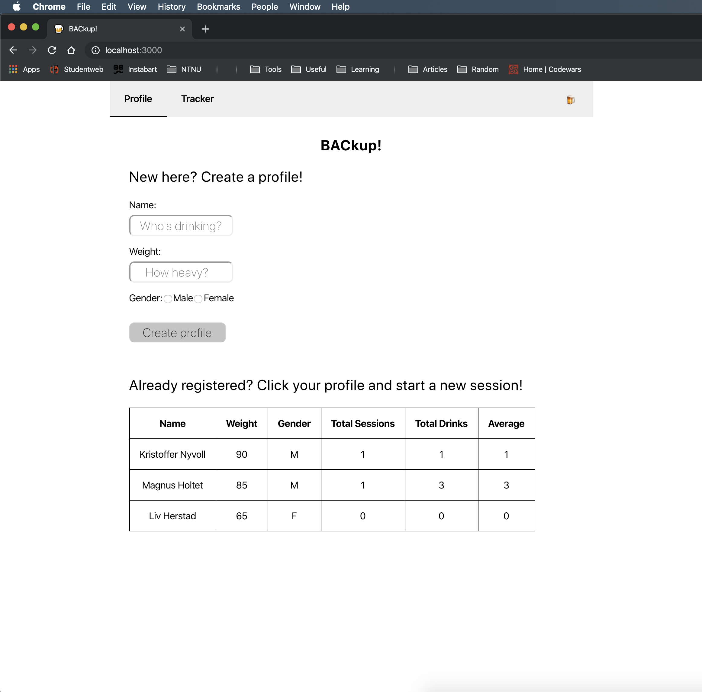
We combined the create profile page and the previous landing page. It looked and worked better this way.

What is removed:

1. `Load profile` - button.
2. `Fetch registered users` - button.

Reason:

1. The button existed due to bad planning in the previous hand-in. We couldnt find a way to load data into the system until the very last second. Removed it now, as it would be _very_ un-natural for a user to load it's data from the computer.

2. In the previous hand in we started the server and the UI at the same time, - however the UI was way faster than the backend. If we automatically fetched the users, it would crash because the server wasn't ready. This is fixed now, and therefore the button is removed.

### Tracker page

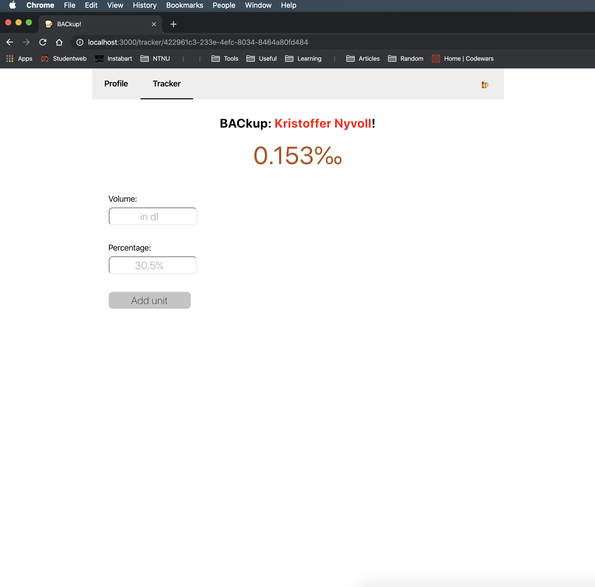
What is removed:

1. `Store data`-button.

Reason:

1. Earlier we stored the user only when we wanted to. Now we update the user and store it on the backend, each time a unit is added. This prevents the user from losing data if the system crashes.

### Wrong page

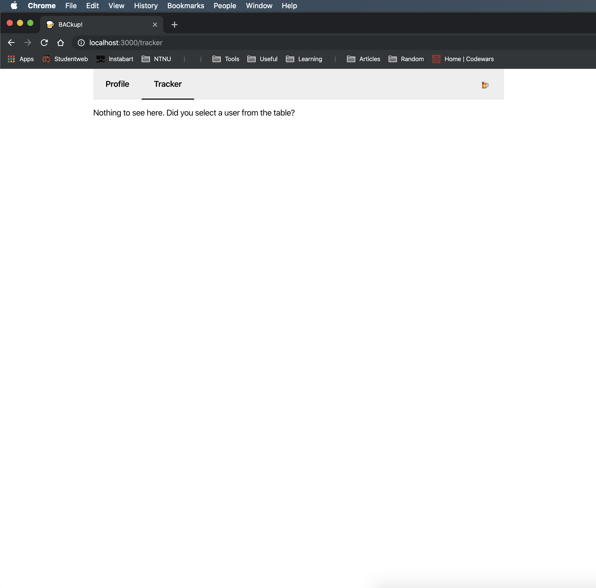

---

# Diagrams

## Package Diagram

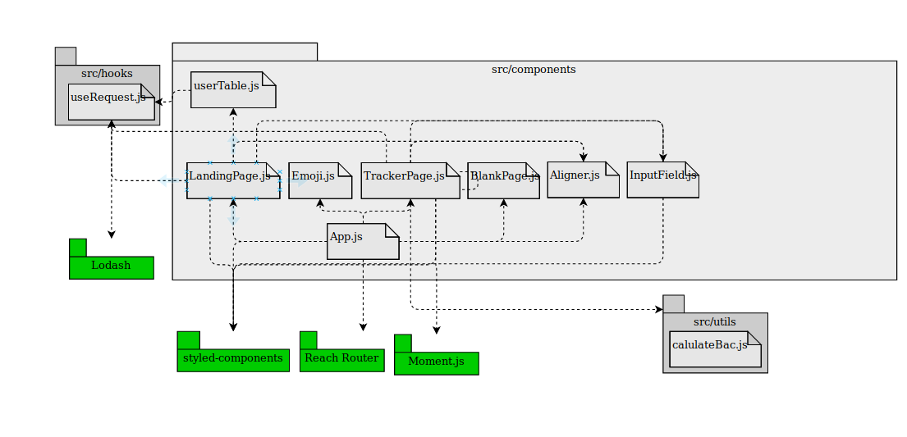
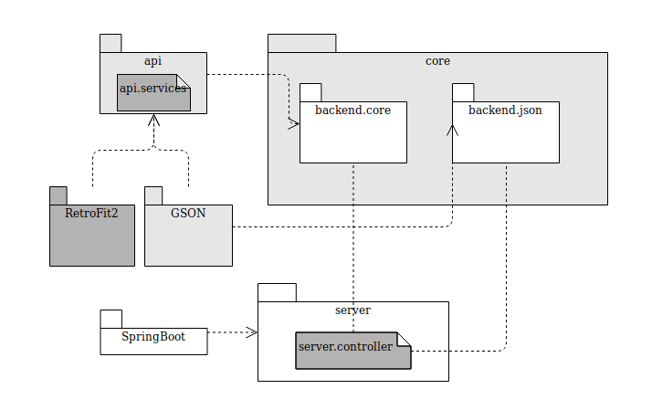

---

## Class Diagram

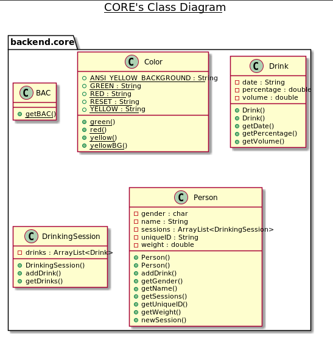
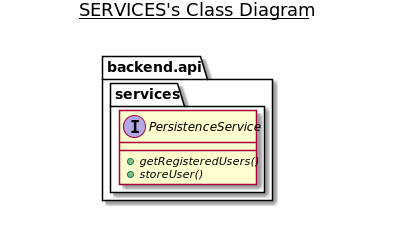

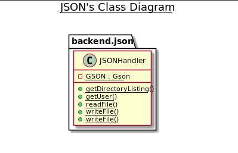
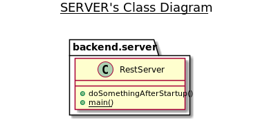
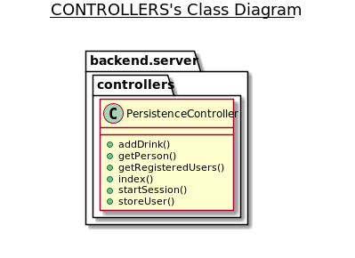

---

## Sequence Diagram

Adding a unit on a user.
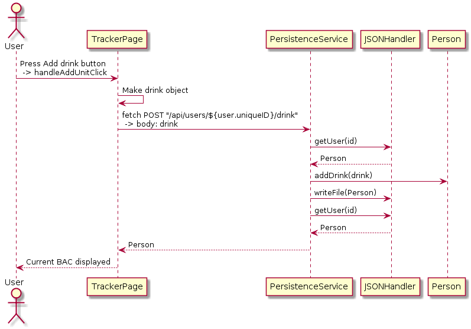
